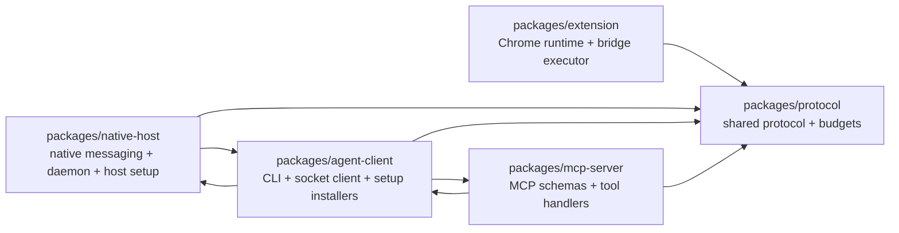
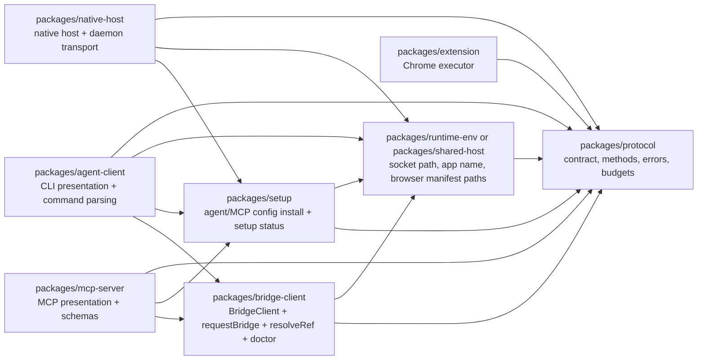

# Browser Bridge Modularity Refactor Plan

## Scope

This plan is based on a read-only review of `README.md`, `package.json`, and the main source trees under `packages/*`. It targets the modularity bottleneck reported by Sentrux: 76 cross-module edges out of 122 total import edges, roughly 62% cross-module. A lightweight local import scan over source files found 71 cross-package source edges. Many of those are acceptable dependencies on `packages/protocol`; the risky coupling is concentrated in bidirectional runtime/setup dependencies between `agent-client`, `native-host`, and `mcp-server`.

The project is currently one npm package with internal package directories:

- `packages/protocol`: shared request/response shapes, method registry, normalization, budgeting, summaries, errors.
- `packages/extension`: MV3 service worker, content script helpers, UI helpers, Chrome APIs, debugger/CDP routing.
- `packages/native-host`: native messaging host, socket daemon, native manifest installation, host config.
- `packages/agent-client`: CLI, socket client, runtime helpers, agent skill/MCP config installers, setup status.
- `packages/mcp-server`: MCP stdio server, tool schemas, tool handlers.

## Current Boundary Graph



Observed cross-boundary edges:

- `agent-client -> protocol`: expected; CLI/runtime uses method registry, request summaries, budget context.
- `extension -> protocol`: expected; extension validates and executes the shared bridge contract.
- `native-host -> protocol`: expected; daemon validates requests, emits structured failures, parses JSON lines.
- `mcp-server -> protocol`: expected; MCP exposes the shared bridge methods and budget vocabulary.
- `native-host -> agent-client`: problematic. `packages/native-host/src/daemon.js` imports `installAgentFiles`, `removeAgentFiles`, `installMcpConfig`, `removeMcpConfig`, and `collectSetupStatus` from `agent-client`. This makes the daemon depend on agent/editor install implementation details.
- `agent-client -> native-host`: partly problematic. `cli.js`, `client.js`, and `runtime.js` import `getSocketPath`, manifest paths, supported browsers, and manifest install/uninstall helpers from `native-host`. Some of this is host config, but it makes the CLI/client depend on host internals.
- `mcp-server -> agent-client`: problematic but understandable. `handlers.js` imports `requestBridge`, `resolveRef`, `withBridgeClient`, `getDoctorReport`, `collectSetupStatus`, and summary helpers from `agent-client`. This makes MCP a presentation layer over CLI/runtime code rather than a sibling adapter over a shared runtime.
- `agent-client -> mcp-server`: problematic. `cli.js` imports `startBridgeMcpServer` so `bbx mcp serve` can run the MCP server. This creates a presentation-layer cycle.

## Boundary Problems

### 1. Setup/install ownership is in the wrong place

Agent/editor setup lives under `agent-client`, but the extension side panel calls setup through the daemon (`setup.get_status`, `setup.install`). Because the daemon imports `agent-client` setup functions directly, `native-host` has become an orchestration point for agent integrations. That creates a reverse dependency from infrastructure transport into CLI/editor concerns.

The domain boundary should be: setup/install is a shared setup service, consumed by CLI, MCP, and daemon. The daemon should not know whether setup files are implemented in `agent-client`.

### 2. Socket and native-host config are mixed with native-host implementation

`getSocketPath`, `getBridgeDir`, `APP_NAME`, `SUPPORTED_BROWSERS`, and manifest path knowledge are exported from `native-host/src/config.js`. These are shared environment/host constants used by the socket client and doctor checks. Putting them under `native-host` forces `agent-client` to import from native-host even when it only needs a transport endpoint or manifest metadata.

The boundary should be: shared host environment/config lives in a small shared module. Native host implementation and client runtime both depend on that module.

### 3. MCP handlers depend on CLI runtime

`mcp-server/src/handlers.js` imports `agent-client/src/runtime.js` and `agent-client/src/subagent.js`. The MCP server is not just using the low-level `BridgeClient`; it also depends on CLI-oriented doctor/runtime helpers. This couples two adapters that should be siblings.

The boundary should be: shared bridge runtime helpers (`BridgeClient`, `requestBridge`, `resolveRef`, doctor report, response summary) live in a runtime/client-core module. CLI and MCP both consume that module.

### 4. CLI starts MCP directly

`agent-client/src/cli.js` imports `mcp-server/src/server.js` for `bbx mcp serve`. This is convenient but creates a reverse adapter dependency: the CLI package depends on the MCP adapter. In a monorepo-style package this works, but it makes module health worse and makes future packaging harder.

The boundary should be: `bbx-mcp` remains the MCP entry point. If `bbx mcp serve` must stay, use a tiny dynamic entrypoint or command delegation that does not make normal CLI/runtime import graphs depend on MCP.

### 5. Extension background is large but mostly internally coupled

`extension/src/background.js` is large and imports many protocol normalizers. That size is a maintainability issue, but not the main cross-module bottleneck. The extension package mostly points one-way into `protocol` and internal helpers. Do not start the modularity refactor by splitting extension handlers unless touching bridge execution behavior is already required.

## Target Boundary Graph



The key rule: adapters may depend on shared core modules; adapters should not depend on each other. Expected adapters are `extension`, `native-host`, `agent-client`, and `mcp-server`.

## Migration Steps

### Step 1: Introduce a shared host environment module

Create a small module, for example `packages/shared-host/src/config.js` or `packages/runtime-env/src/index.js`, and move only pure constants/path helpers from `native-host/src/config.js`:

- `APP_NAME`
- `BRIDGE_HOME_ENV`
- `PUBLISHED_EXTENSION_ID`
- `getBridgeDir`
- `getSocketPath`
- `SUPPORTED_BROWSERS`
- `getManifestInstallDir`
- `getLauncherFilename` if used outside manifest installation

Update `native-host`, `agent-client/client.js`, and `agent-client/runtime.js` to import these from the new shared module. Keep re-exports in `native-host/src/config.js` temporarily for compatibility inside the repo.

Risk: low to medium. Path behavior is platform-sensitive, especially Windows native messaging paths.

Rollback: restore imports to `native-host/src/config.js` and leave the new module unused or delete it in a follow-up revert.

Commit boundary: one commit containing the new module, imports, and tests for config path behavior.

### Step 2: Extract setup/install services out of `agent-client`

Create `packages/setup/src` for agent/editor setup responsibilities currently in:

- `packages/agent-client/src/install.js`
- `packages/agent-client/src/mcp-config.js`
- `packages/agent-client/src/detect.js`
- `packages/agent-client/src/setup-status.js`

Move the implementation in stages, or first create pass-through modules under `packages/setup/src` that re-export the existing functions. Then invert imports:

- `native-host/src/daemon.js` imports setup functions from `packages/setup/src`.
- `agent-client/src/cli.js` imports setup functions from `packages/setup/src`.
- `mcp-server/src/handlers.js` imports setup status from `packages/setup/src`.

Keep `agent-client/src/install.js`, `mcp-config.js`, `detect.js`, and `setup-status.js` as compatibility re-exports for one release if external users might import internal files, even though they are not documented public API.

Risk: medium. Agent support has many alignment requirements across code/docs/UI, and setup behavior is user-facing.

Rollback: switch import sites back to the original `agent-client/src/*` files. If using re-export shims first, rollback is mostly import-only.

Commit boundary: first commit adds setup package with re-exports; second commit updates imports; third commit optionally moves actual implementations.

### Step 3: Extract bridge client/runtime core

Create `packages/bridge-client/src` or `packages/runtime/src` with:

- `BridgeClient` from `agent-client/src/client.js`
- `ensureClientConnected`
- `requestBridge`
- `resolveRef`
- `withBridgeClient`
- doctor helpers that are not CLI presentation
- summary re-exports currently in `agent-client/src/subagent.js`, or move them fully to `protocol` consumers

Then update:

- `agent-client/src/cli.js` to import runtime/core from the new module.
- `mcp-server/src/handlers.js` to import runtime/core from the new module.
- Tests to depend on the new module where they are testing runtime behavior.

This removes the direct `mcp-server -> agent-client` dependency for normal bridge operations.

Risk: medium. Timeout, socket reconnect, protocol warning, and doctor behavior are central to CLI and MCP reliability.

Rollback: leave `agent-client/src/client.js` and `runtime.js` as re-export shims and point consumers back if failures appear.

Commit boundary: one commit for `BridgeClient`; one commit for `runtime/doctor`; one commit for MCP import migration.

### Step 4: Break the CLI/MCP presentation cycle

Remove the static import from `agent-client/src/cli.js` to `mcp-server/src/server.js`. Options:

- Keep `bbx mcp serve`, but use a dynamic import inside only the `command === 'mcp' && subcommand === 'serve'` branch.
- Or delegate to the published `bbx-mcp` bin through `process.execPath` and the known local path, similar to how `bbx install` delegates to the native manifest installer.

The dynamic import still has a runtime dependency but removes the static graph cycle and keeps normal CLI usage independent of MCP server startup.

Risk: low. Behavior is isolated to `bbx mcp serve`.

Rollback: restore the static import and branch call.

Commit boundary: one small commit plus a CLI test for `mcp config` and, if practical, a smoke test for `mcp serve` construction.

### Step 5: Add an import-boundary check

Add a lightweight script or lint rule that fails on adapter-to-adapter imports except approved entrypoint cases. Suggested allowed dependency directions:

- Any package may import `protocol`.
- `native-host`, `agent-client`, and `mcp-server` may import shared `runtime-env`, `setup`, and `bridge-client` as appropriate.
- `extension` may import `protocol` and its own internal files only.
- `agent-client` must not statically import `mcp-server`.
- `mcp-server` must not import `agent-client`.
- `native-host` must not import `agent-client`.
- `agent-client` must not import `native-host` except temporary shims during migration.

Risk: low. Main risk is making the rule too strict before migrations are complete.

Rollback: keep the script but remove it from CI/lint, or mark violations as warnings until the next commit.

Commit boundary: one commit after Steps 1-4 so the rule encodes the new architecture rather than blocking the migration.

### Step 6: Optional extension internal split

After cross-adapter coupling is fixed, consider splitting `extension/src/background.js` by capability group:

- request dispatch and response enrichment
- tab/window access routing
- setup-status UI bridge
- page/DOM/content-script methods
- debugger/CDP methods
- action log/UI state

This is not the first modularity target because it mostly reduces file size and internal complexity, not cross-module coupling.

Risk: high relative to ROI. Extension service worker behavior, Chrome event listeners, debugger coordination, and setup UI all meet in this file.

Rollback: avoid doing this until there is strong test coverage around the specific capability group being moved.

Commit boundary: one capability group per commit only.

## Proposed Commit Sequence

1. `shared-host`: add shared path/config module and migrate imports from `agent-client` and `native-host`.
2. `setup`: add setup service module with re-exports, then point daemon/CLI/MCP to it.
3. `bridge-client`: move `BridgeClient` and bridge runtime helpers out of `agent-client`.
4. `mcp`: update handlers to use bridge-client/setup instead of agent-client.
5. `cli`: remove static CLI -> MCP import.
6. `lint`: add import-boundary check.

## Risk Summary

Highest-risk areas:

- Native messaging manifest paths on Windows/macOS/Linux.
- Setup install/uninstall for all supported agents: codex, claude, cursor, copilot, opencode, antigravity, windsurf, agents.
- MCP handler behavior where summaries and token budgets must stay stable.
- Socket client timeout/protocol-warning behavior.

Lower-risk areas:

- Pure import-source changes when shims/re-exports are kept.
- Dynamic import for `bbx mcp serve`.
- Import-boundary check after the graph is cleaned.

## Rollback Strategy

Prefer migration shims over big moves. For each extracted module, keep the old file path as a re-export until the new imports have landed and tests pass. This makes rollback a small import reversal instead of a file reconstruction.

For every step, run:

```bash
npm run lint
npm run typecheck
npm test
```

When touching native-host or extension protocol paths, also run at least one live CLI flow against Chrome if available, for example:

```bash
npx bbx status
npx bbx doctor
```

## Do Not Do

- Do not redesign the bridge protocol while doing this refactor.
- Do not add task-specific bridge methods to solve modularity.
- Do not split `extension/src/background.js` as the first step.
- Do not change public CLI command names or published docs as part of internal boundary cleanup.
- Do not modify the manually maintained Supported Agents table in `README.md`.
- Do not combine behavior changes with import-boundary moves.
- Do not introduce TypeScript conversion or build-system changes in the same refactor.
- Do not change native manifest install locations except by moving existing helpers without semantic changes.
- Do not remove compatibility re-export shims until at least one release boundary or explicit maintainer approval.
- Do not touch git remotes, upstream fork configuration, or release metadata for this plan.

## Success Criteria

The refactor is complete when the only routine cross-package dependencies are adapter-to-core/shared dependencies:

- `extension -> protocol`
- `native-host -> protocol/shared-host/setup`
- `agent-client -> protocol/shared-host/setup/bridge-client`
- `mcp-server -> protocol/setup/bridge-client`

There should be no static imports:

- `native-host -> agent-client`
- `agent-client -> native-host`
- `mcp-server -> agent-client`
- `agent-client -> mcp-server`

This should reduce the high-value cross-module coupling while preserving BBX's current single-package npm publishing model and keeping the protocol surface stable.
